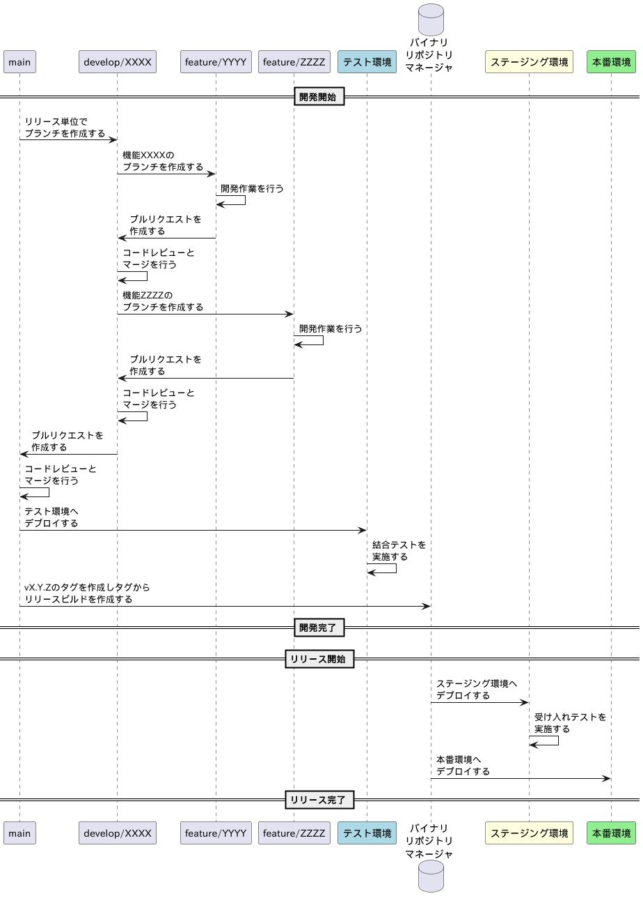

# road-to-agile-dev

『[アジャイルへの道](https://zenn.dev/thorie/books/road-to-agile)』の執筆用のPoCリポジトリです。この本で想定されている内容を実装するためのサンプルコードやツールを提供しています。

# アジャイルTODOマネージャ

TODO管理ソフトウェアのリポジトリです。本リポジトリでは、フロントエンド、バックエンド、データベースのスキーマ定義、インフラストラクチャのコードを含んでいます。プロダクトのタスク管理は、こちらの[JIRA](https://jira.example.com)で行います。

## 開発環境

以下のソフトウェアをインストールしてください。

- JDK(Version 25)
- Node.js(Version 25)
- Docker(Version 28)
- AWS CLI(Version 2.31.0以降)
- Terraform(Version 1.13)

## ローカルPCで実行方法

Docker Compose を使ってフロントエンドとバックエンドを起動できます。以下のコマンドを実行してください。

```bash
docker compose up -d --build
```

フロントエンドのURLは http://localhost:8081/ です。 バックエンドのAPIのURLは http://localhost:8080/ です。
バックエンドが起動できているかを確認するには、以下のコマンドを実行してください。

```bash
curl http://localhost:8080/actuator/health
```

## ローカルPCでの自動テスト

### フロントエンドのテスト

以下のコマンドを実行してください。
```bash
cd frontend
npm run test:run
```

### バックエンドのテスト

以下のコマンドを実行してください。
```bash
cd backend
./mvnw clean test
```

## アーティファクトの管理

各コンテナのイメージを以下のECRリポジトリで管理しています。
- フロントエンド: `123456789012.dkr.ecr.us-west-2.amazonaws.com/todo-manager-dev-frontend`
- バックエンド: `123456789012.dkr.ecr.us-west-2.amazonaws.com/todo-manager-dev-backend`

dev環境では `latest` タグが使用されます。

## ブランチ管理

ブランチのフローは以下の図の通りです。



